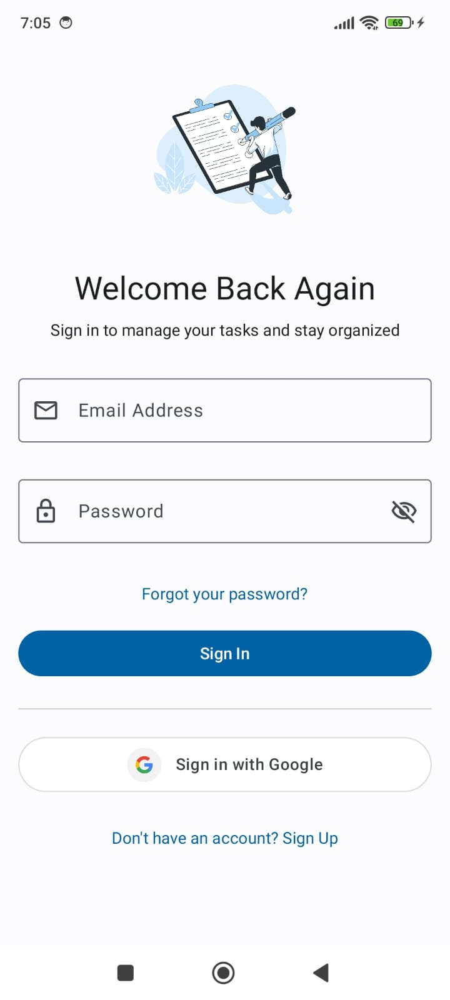
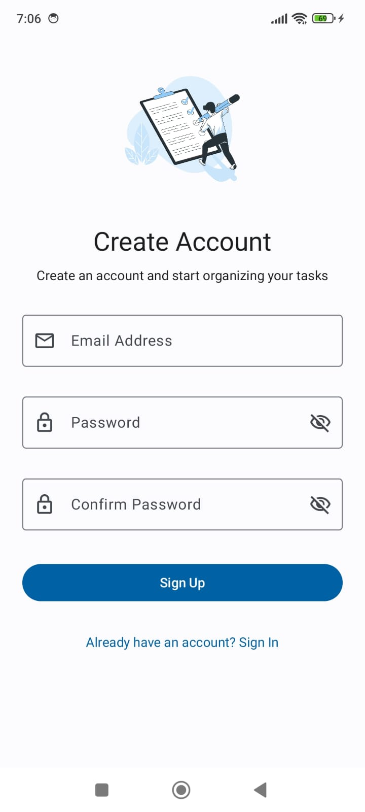
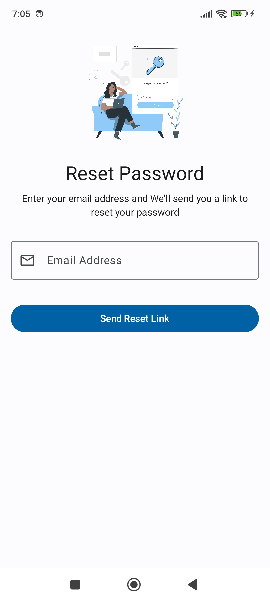
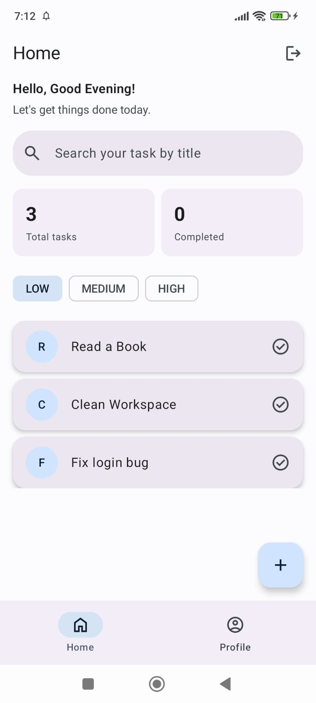
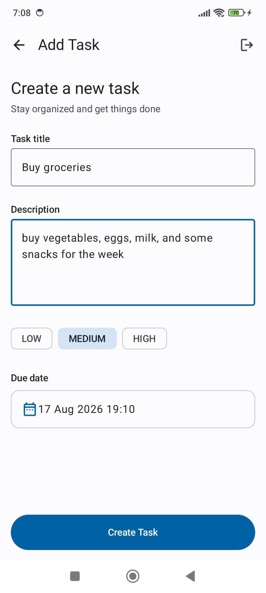
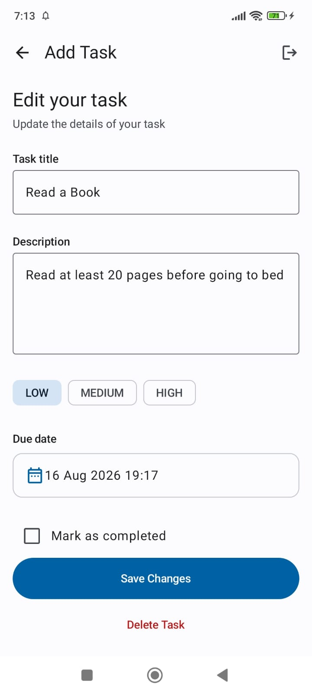
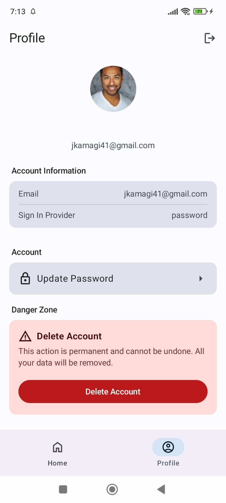
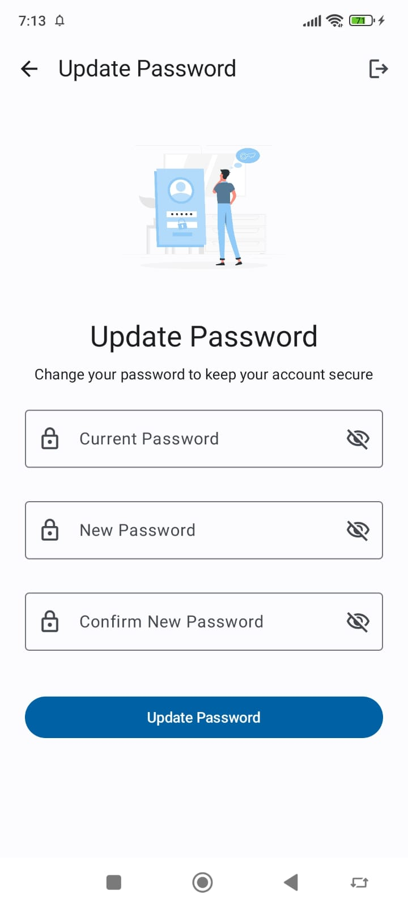
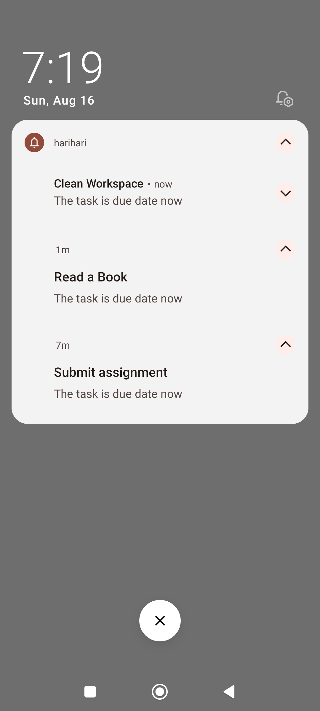

# Harihari App

> Organize your day. Remember what matters.

**harihari** is a simple to-do app for staying on top of your day. Add tasks, set priorities, and get reminded before things slip your mind — with easy sign-in, so your tasks are always synced and just a login away.

---

## Screenshots

| Login | Register | Forgot Password |
|:---:|:---:|:---:|
|  |  |  |

| Home | Create Task | Edit Task |
|:---:|:---:|:---:|
|  |  |  |

| Profile | Update Password | Notification |
|:---:|:---:|:---:|
|  |  |  |
## Demo Video

[▶️ Watch Demo Video](https://www.youtube.com/watch?v=m8yjMPSx-oU)

---

## Features

**Authentication**
- Register & login with email/password
- Google Sign-In
- Email verification, forgot password, change password
- Delete account & logout

**To-do**
- Create, edit, delete, search (by title), sort (by priority)
- Priority levels: Low, Medium, Urgent
- Per-task reminders with notifications

**Reminder**
- Scheduling via `AlarmManager`
- Reminder data stored locally with `Room`
- Reminders automatically restored after device restart (`BroadcastReceiver` + `WorkManager`)

---

## Project Information

| Information | Details |
|---|---|
| App Name | harihari |
| Platform | Android |
| Language | Kotlin |
| Minimum SDK | 30 |
| Target SDK | 37 |
| Compile SDK | 37 |
| Java | 17 |
| Architecture | Clean Architecture |
| Firebase Environment | Firebase Emulator |

---

## Tech Stack

**Core**

| Technology | Version | Purpose |
|---|---:|---|
| Kotlin | 2.4.0 | Primary programming language |
| Android SDK | API 37 | Application development |
| Java | 17 | JVM target |
| Kotlin Serialization | 1.11.0 | Data serialization |

**Android & Architecture**

| Technology | Version | Purpose |
|---|---:|---|
| Jetpack Compose | 2026.06.01 | UI development |
| Material 3 | Compose BOM | UI components |
| Navigation Compose | 2.9.8 | Screen navigation |
| Lifecycle Runtime KTX | 2.11.0 | Lifecycle management |
| Hilt | 2.60.1 | Dependency injection |
| AndroidX Hilt | 1.4.0 | Hilt integration |

**Local Storage & Background**

| Technology | Version | Purpose |
|---|---:|---|
| Room | 2.8.4 | Local database |
| WorkManager | 2.11.2 | Background task processing |
| AlarmManager | Android SDK | Reminder scheduling |
| BroadcastReceiver | Android SDK | Device restart detection |
| Notification | Android SDK | Task reminders |

**Firebase & Authentication**

| Technology | Version | Purpose |
|---|---:|---|
| Firebase BOM | 34.15.0 | Firebase dependency management |
| Firebase Authentication | Firebase BOM | User authentication |
| Cloud Firestore | Firebase BOM | Cloud task storage |
| Credential Manager | 1.6.0 | Credential management |
| Google Identity Services | 1.2.0 | Google Sign-In |

**Media & Testing**

| Technology | Version | Purpose |
|---|---:|---|
| Coil | 3.5.0 | Image loading |
| JUnit | 4.13.2 | Unit testing |
| AndroidX JUnit | 1.3.0 | Android testing |
| Espresso | 3.7.0 | UI testing |
| MockK | 1.14.11 | Mocking |

---

## Project Structure

```text
com.alezandrow.simplecleanarchitecture
│
├── common
├── data
│   ├── alarm
│   ├── mapper
│   ├── notification
│   ├── repository
│   └── source
│       ├── local
│       └── network
├── di
├── domain
│   ├── entities
│   │   ├── task
│   │   └── user
│   ├── repository
│   └── usecase
│       ├── auth
│       ├── task
│       └── validation
├── presentation
│   ├── component
│   ├── icon
│   ├── navigation
│   ├── screen
│   ├── state
│   └── theme
├── util
└── worker
    └── RescheduleAlarmWorker
```

At the repository root, `FirebaseBackend/` holds the Firebase Emulator configuration (see [Installation](#installation)).

| Package | Responsibility |
|---|---|
| `common` | Shared constants used across the app (channel IDs, intent keys, etc.) |
| `data.alarm` | Alarm scheduling and broadcast receivers for reminders |
| `data.mapper` | Mapping between local, remote, and domain models |
| `data.notification` | Notification building and dispatching |
| `data.repository` | Repository implementations for tasks and auth |
| `data.source.local` | Room database, DAOs, and local data source |
| `data.source.network` | Firebase Auth & Firestore data source |
| `di` | Dependency injection modules (Hilt) |
| `domain.entities.task` | Task domain model |
| `domain.entities.user` | User domain model |
| `domain.repository` | Repository interfaces (contracts) |
| `domain.usecase.auth` | Use cases for login, register, and account management |
| `domain.usecase.task` | Use cases for creating, editing, and reminders |
| `domain.usecase.validation` | Input validation logic (email, password, task fields) |
| `presentation.component` | Reusable UI components |
| `presentation.icon` | Custom icon assets |
| `presentation.navigation` | Navigation graph and routes |
| `presentation.screen` | App screens (login, home, task, profile, etc.) |
| `presentation.state` | UI state holders for screens |
| `presentation.theme` | Colors, typography, and app theming |
| `util` | General utility and helper functions |
| `worker.RescheduleAlarmWorker` | Restores reminders after device restart |

---

## App Flow

**Authentication**
```text
Login / Register ── Email & Password / Google Sign-In ──▶ Home
```

**Forgot Password**
```text
Forgot Password ──▶ Enter Email ──▶ Firebase ──▶ Reset Password Email
```

**Home**
```text
Home
 ├── Search / Sort
 ├── Create To-do ──▶ Firestore & Room ──▶ AlarmManager ──▶ Notification
 └── Edit To-do
```

**Reminder Recovery**

When the device restarts, scheduled alarms are lost by the system. harihari restores them from the reminder data saved in Room.

```text
Device Restart ──▶ BOOT_COMPLETED ──▶ BroadcastReceiver ──▶ WorkManager ──▶ Room ──▶ AlarmManager
```

**Profile**
```text
Profile
 ├── Account Information
 ├── Change Password
 ├── Delete Account
 └── Logout
```

---

## Installation

1. **Clone the repository**
   ```bash
   git clone <repository-url>
   cd harihari
   ```
2. **Open the project** in Android Studio and wait for Gradle Sync to finish.
3. **Requirements**
   - Android Studio
   - JDK 17
   - Android SDK 37
   - Android device/emulator with API 30+
4. **Run the Firebase Emulator** (this project uses the Firebase Emulator for development)

   Emulator configuration (`firebase.json`, `.firebaserc`, rules, etc.) lives in the `FirebaseBackend/` folder at the project root.

   ```bash
   cd FirebaseBackend
   firebase emulators:start
   ```

5. **Set `DEVICE_IP`** (only needed when testing on a physical device)

   The app connects to the Firebase Emulator via `BuildConfig.DEVICE_IP`, which is generated from a `DEVICE_IP` property you set locally — this keeps your personal IP out of git.

   **a. Add it to `local.properties`** (at the project root, not tracked by git):
   ```properties
   DEVICE_IP=192.168.1.7
   ```
   If this key isn't set, the build falls back to `10.0.2.2` (the Android Studio emulator's default alias for the host machine's `localhost`), so the app still works out of the box on an emulator.

   **b. Update `res/xml/network_security_config.xml`** with the same IP, so cleartext traffic to it is permitted:
   ```xml
   <domain includeSubdomains="true">192.168.1.7</domain>
   ```

   > Note: unlike `local.properties`, this file **is** tracked by git. If you're on a physical device, edit the IP here manually and avoid committing your personal IP if it's not meant to be shared with other contributors.

   Make sure your phone and computer are on the same Wi-Fi network.

6. **Connect an Android device or emulator**

   You can run the app on either:
   - A physical Android device with USB debugging enabled
   - An Android Emulator running API 30 or higher

   To create an emulator, go to:
   ```text
   Android Studio → Device Manager → Create Device
   ```
   Select a device and system image that meets the minimum SDK requirement.

7. **Build and run**

   Select your connected device or emulator in Android Studio, then go to:
   ```text
   Run → Run 'app'
   ```
   or press the **▶ Run** button.

   Android Studio will build the project, install the app, and launch harihari on the selected device.